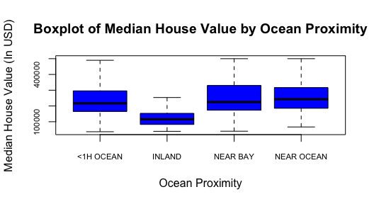
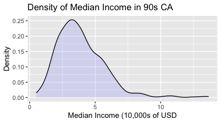

Project Step 1
================
Sara Chong

## California House Pricing Data

The contents of the California House Pricing Dataset represent
information on houseswithin a given block in California from the 1990
census. The variables outlined in the dataset are given below in the
following table. Each variable corresponds to an attribute of the
observational unit, the collection of houses within one square block in
the state. Using this data, we can analyze and interpret basic trends
that can lead to insight into what factors contribute the housing market
in the state of California.

| Variables          | Description                                                                                      |
|:-------------------|:-------------------------------------------------------------------------------------------------|
| Longitude          | Westward location; higher value is farther West                                                  |
| Latitude           | Northward location; higher value is farther North.                                               |
| Housing Median Age | Age of houses within a block.                                                                    |
| Total Rooms        | The total number of rooms within a given block.                                                  |
| Total Bedrooms     | The total number of bedrooms within a given block.                                               |
| Population         | The total population within a given block.                                                       |
| Households         | The total number of households within a given block.                                             |
| Median Income      | The median total income of households within a given block (Measured in 10s of thousands of USD) |
| Median House Value | The median valuation of houses in a given block in USD                                           |
| Ocean Proximity    | The location of the block in relation to the nearest ocean/sea                                   |

Perhaps the most important variable from this given data set is the
Median House Value of the houses within any given block. This variable
will have the greatest importance to the audience this data is
attempting to serve, those interested in the details of land ownership
within the state of California. Because this variable is the most
influential, it is imperative that we take a deeper dive into how it
fits into the data given through the 1990 California census data.

# House Value Analysis

In order to begin analyzing our data, we must first read in the census
data in its entirety, then take a smaller samples size (around 500
observations) in order to look at the trends of the given data. In order
to produce repeatable results, we set the seed in the following code
chunk to ‘1’, so the resulting sample will draw from the same
observations every time. If a different observation set is required, we
can simply change the seed.

Now that we have defined our sample, we can utilize built in R functions
to perform statistical analysis on our data set. As we are currently
reviewing the median house value variable, it would be important to
learn more about how the values of this element are structured;
therefore, the distribution plot of the variable is included below.


From this plot of the distribution of median house value, it can be
concluded that the data is heavily left skewed meaning that there is a
larger percentile of homes within the \$0 to \$250,000 price range. This
trend is similarly shown in other data samples generated from varying
seeds. One aspect to notice of this graph is the small inflection
towards the right end of the distribution function where the amount of
homes at the given price range tends to increase in comparison to the
amount at the intermediate value. In conjunction, these two observations
of the data suggest to us that the median housing values across the
state of California tend to be representative of higher volumes in the
\$100,000 range while the amount of homes decreases as the price
increases except for an outlying greater number of homes in the higher
price range. In addition to the distribution function, it can be
beneficial to display more information about the break down of this
variable’s distribution. Concisely, using the ‘skim’ function from the
‘skimr’ package in R will give us a brief summary of the statistics that
we can utilize later on in our analysis.

``` r
skim(data_sample$median_house_value)
```

| Statistic              | Value   |
|------------------------|---------|
| Mean                   | 210,605 |
| Standard Deviation     | 113,318 |
| 1st Percentile (1st)   | 36,700  |
| 25th Percentile (25th) | 127,025 |
| Median (50th)          | 185,100 |
| 75th Percentile (75th) | 263,925 |
| Maximum (100th)        | 500,001 |

# The Relationship Between Ocean Distance and Property Value

Now that we have introduced and begun to discuss one of the more
influential variables form the California Housing data set, its
imperative that we take a deeper look into more variables, as well as
analyzing any relationships they might have with one another. One of the
more obvious relationships that can be observed from the data without
much foresight is a possible connection between the median property
value of homes within a block and the distance that the corresponding
block is from the ocean. Based on intuition and general knowledge, it’s
safe to assume that it is very likely that houses that are closer to the
beach are more likely to have a higher median property value, and vice
versa. Consequently, we can use formulas built into R to take a look at
a the possible existence of a relationship between the variable “Median
House Value” and “Ocean Proximity” to see if we our intuitions are
justified. The following graph plots Median House Value within each
block in the sample data set against the block’s proximity to the ocean.

As the box plot above demonstrates, there seems to be a trend that homes
within the data sample tend to have an increased property value if they
are under an hour away from the ocean or a bay in comparison to homes
inland in California. These observations concur with the data samples
generated by different seeds.

# Median Income Analysis

Another very influential variable from the data set is the observations
of “Median Income” throughout houses on an identified block. This
variable gives the median income, in tens of thousands of United States
Dollars, of each block. Therefore, each individual within a home
contributes to their houses income, which then outlined per block where
the median is then calculated which is the resulting value that is
contained in the data set. This variable can be quite insightful to the
audience as well because it is closely relatable to the viewer;
therefore, understanding the statistical data around it is quite
important. Like shown before with the median house value variable,
utilizing R plot the distribution function for this variable is a good
place to start.

Similarly to the distribution graphs shown earlier, a quick and brief
analysis of the distribution of Median Income shows that the
distribution is also heavily skewed to the left. As a result, it
suffices to say that both median income and median housing value contain
some factors that draw out their distributions in such a manner.
Likewise, utilizing ‘skimr’ produces a concise table of the mean,
standard deviation, and percentiles in order to perform greater
statistical analysis.

``` r
skim(data_sample$median_income)
```

| Statistic              | Value (In 10,000s of USD) |
|------------------------|---------------------------|
| Mean                   | 3.9                       |
| Standard Deviation     | 1.82                      |
| 1st Percentile (1st)   | 0.5                       |
| 25th Percentile (25th) | 2.62                      |
| Median (50th)          | 3.6                       |
| 75th Percentile (75th) | 4.87                      |
| Maximum (100th)        | 13.66                     |

# The Relationship Between Property Value and Income

Lastly, it is of note to pay close attention to the relationship between
both of these two variables listed above. Even though they share quite
similarly left skewed distributions does not mean that they pertain any
relationship. In order to dive a little bit deeper into these two
statistics, we can graph a scatter plot in R that demonstrates their
potential correlation which can be further refined later down the road.

When layed out in a scatter plot as done above, these two variables
demonstrate a linear progression of increasing value. Seemingly, as the
median income of a particular housing block increases, so does the
median house value.
