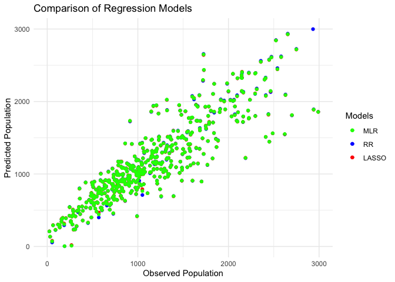
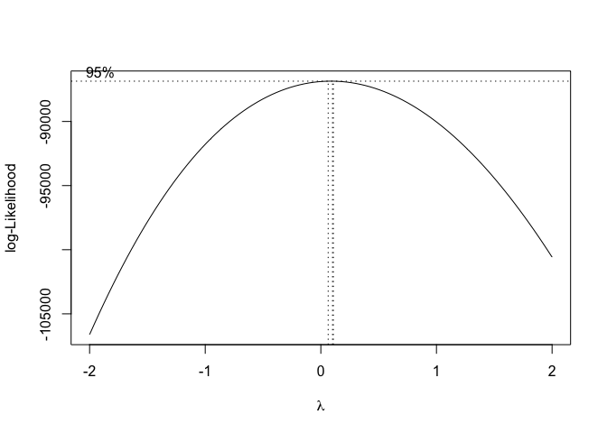

Project Step 4
================
Sara Chong

## Descriptor

The California House Pricing Dataset from Kaggle encapsulates a snapshot
of houses within specific Californian blocks as recorded during the 1990
census. The dataset encompasses a range of attributes that define these
housing units. In this step of our analysis, we will be attempting to
further dissect our multiple linear model that we previously built by
applying shrinkage methods to our model. In multiple linear regression,
the purpose of the techniques of specific shrinkage methods is to
counteract the inaccuracies of multicollinearity and model overfitting.
In order to accomplish this, we will randomly sample 500 observations
from the data and fit them to our model and execute ridge regression and
LASSO regression techniques to better fit our multiple linear model.

## Shrinkage Methods

The first step of our dissection of our previously drawn up model is to
compare it to a model without any modifications. Therefore, the
following output is the summary of a linear regression model with all
numerical variables as the predictors.

                             Estimate    Std. Error    t value     Pr(>|t|)
    (Intercept)        195.9052315453 63.7866882689  3.0712557 2.250321e-03
    housing_median_age   2.6781007808  1.4075281272  1.9026979 5.766708e-02
    total_rooms          0.1819696346  0.0265555296  6.8524197 2.192930e-11
    total_bedrooms      -1.3736850886  0.2119119543 -6.4823388 2.210059e-10
    households           3.1104121962  0.1931884094 16.1004079 4.178242e-47
    median_income        6.2507239555 14.4528051578  0.4324921 6.655745e-01
    median_house_value  -0.0009630353  0.0002094803 -4.5972598 5.457146e-06

    R^2 of the basic model: 0.8950722

Now that we know these values, we can utilize them to compare and
contrast the model we developed in the last part, as well as perhaps
create a new model that aims to provide even greater accuracy than
before. To do this, we can take our basic model and check the eigen
decomposition of $x^Tx$, which returns the following:

    Eigen decomposition:  1 91.8146 1171.665 3885.293 13522.47 182795.6

From this, we can calculate the R$^2$ value for each of our predictor
variables. This will tell us efficinecy of using our each of these
predictors in our model.

    R-squared for each predictor: 

    housing_median_age: 0.2401913               total_rooms: 0.9292011

    total_bedrooms: 0.9715387                    households: 0.9579462

    median_income: 0.6979749                    median_house_value: 0.6019585

As shown above, three of our variables have a very high coefficients of
determination, two have coefficients of determination that are roughly
average, while one has a coefficient that is relatively low. Because the
first three, total_bedrooms, total_rooms, and households, all have such
a high value, they are succinct to be in our model. Now on the other
hand, the inclusion of the three variables with lower coefficients of
determination means that either they are likely poor(er) predictors of
the response variable, population. Now, we can take a look at the
variance inflation factors to see how they contribute to each predictors
variance within the linear model.

    housing_median_age        total_rooms     total_bedrooms         households 
              1.316121          14.124514          35.135446          23.779075 
         median_income median_house_value 
              3.310983           2.512301 

From these results, the question arises as to why a model that includes
worse predictors of the response variable has a higher coefficient of
determination value than one that does not. As in page two of step 3, we
recall that the R$^2 = 0.88593$ for the model we settled on, while this
one was R$^2= 0.8950722$. Well, this can be caused by noise of variance
that the model doesn’t account for, or simply put the model is more
accurate with these variables included. To dissolve the answer to this
question, we can look to two methods of shrinkage to highlight the best
model we can for our data.

## Ridge Regression

Under the technique of ridge regression, the assumption is that the
regression coefficients shouldn’t be too large after normalization. The
first step we must take is create multiple models with different lambda
values, then find the one that minimizes the inaccuracies of the
response. Essentially, we are formulating new models with a range of
lambda values in order to generate a new linear model with the best fit
for the data. Once we have this, we will plug in our best lambda value
into the ridge regression model in order to get an accurate model.

The range of these lambda values are given in the figure on the
following page, Figure 1 which plots Lambda values versus $\hat{\beta}$.

From that graph and further calculation, we can come to the conclusion
that the lambda value of,

    Best Lambda Value: 98.34711

is what we will use for our ridge regression model.

Figure Demonstrating the Lambda versus Beta Hat

Additionally, we can take the produced ridge regression model and find
the generalized crossvalidation value. As shown below, the output values
of 0.0 and 1 from the analysis indicate that the first element minimizes
the Generalized Cross-Validation criterion. Because of this, selecting
our lambda value to be 0.0 would be a worthwhile choice for our Ridge
Regression model as the low GCV criterion demonstrates that the model’s
complexity and fit are justifiably balanced. From this output, we can
safely assume that our ridge regression model provides an adequate
prediction for our data as a whole.

    Generalized crossvalidation value: 

      0.000000 
             1 

To be succinct, listed below is the scaled coefficients of the intercept
as well as each variable with the model given by the ridge regression
model, along side the R-squared of the model.

    7 x 1 sparse Matrix of class "dgCMatrix"
                                   s0
    (Intercept)        187.1116995281
    housing_median_age   2.8088604026
    total_rooms          0.1754168111
    total_bedrooms      -1.2489728832
    households           3.0077776964
    median_income        8.8783856063
    median_house_value  -0.0009831492

Leaving us with the regression model following the form:
$$population = 187.11 + 2.808x_1 + 0.175x_2 - 1.250x_3 + 3.008x_4+8.88x_5 - 0.0009x_6$$
where $x_1$ is housing_median_age, $x_2$ is total_rooms, $x_3$ is
total_bedrooms, $x_4$ is households, $x_5$ is median_income, $x_6$ is
median_house_value.

## Lasso Regression

While Ridge Regression created a new model to adjust for the overfitting
of our data, we can also use another technique known as Lasso regression
to create another model we can compare against. Like with Ridge
Regression, the first step in creating this model is to isolate the best
lambda for the fit of our data. To do this, we can input our data into
the cv.glmnet function, followed by using that model and finding the
minimuim lambda value for our data.

    Best Lambda for our Models: 0.5248489

As shown above, the lambda value for this model is 0.5248, which is what
we will use when we predict the observations given a set of predictions.
Given below is graph of log($\lambda$) versus the Mean Squared Error of
our data. This plot essentially tells us the most appropriate level of
regularization for a predictive model. The best lambda value given
above, can be found plotted in the figure below suggesting to us where
the balance of the model is most even.

Figure Demonstrating the Log of each Lambda versus MSE

Likewise with this model, we are given the intercept and coefficients of
our model, as shown below.

    Best Model Coefficients:

    7 x 1 sparse Matrix of class "dgCMatrix"
                                   s0
    (Intercept)        192.1178566312
    housing_median_age   2.6686465652
    total_rooms          0.1751836571
    total_bedrooms      -1.2823129776
    households           3.0451067258
    median_income        7.6271246950
    median_house_value  -0.0009637222

A brief analysis of these coefficients tells us that median_house_value
and total_rooms are the variables that have the least influence per unit
change on the response due to their low values, while
housing_median_age, households, and median_income have the most
influence per unit change. This is quite an interesting statistic
because housing_median_age and median_income were variables with lower
correlation than many of the other predictors. This can indicate that
while they do not have the biggest correlation with the explanatory
variable, population, when their influence is apparent, it is
considerably large.

As with Ridge Regression, we can deduce the formula for the Lasso
Regression model as the following:

$$population = 192.11 + 2.668x_1 + 0.175x_2 - 1.282x_3 + 3.045x_4+ 7.67x_5 - 0.0009x_6$$
where $x_1$ is housing_median_age, $x_2$ is total_rooms, $x_3$ is
total_bedrooms, $x_4$ is households, $x_5$ is median_income, $x_6$ is
median_house_value.

## Model Comparison

Lastly, we can take a look and see how these models compare against one
another. In order to do this, we can plot them together.

Comparison of Models: MLR, RR, and LASSO

It is important to note that the scatter plot above excludes multiple
observations with values above 3000 on both the x-axis and y-axis. This
is done to illustrate the scatter of data points better in the lower
regime of values. With that in mind, we can delineate from the scatter
plot above that each model seems to be very close in predicting values
relatively to one another. No model in particular seems to have a
greater skew than another, as nearly all the data points are very
similar to each other. This is interesting as it can give us insight
into the accuracies of our models and how sufficient they are at
predicting our response variable.

## Conclusion

The three models that we formulated in this data step all seemed to
accurately represent the data with consistency. It is of interesting
note just how similar the models were to one another. While coefficients
of each linear model is different, their differentiation is quite
minimal. Ultimately, the shrinkage models add onto the analysis through
the multiple linear regression model by combatting any unobserved
inaccuracies of multicollinearity and model overfitting. In conjuncture
with each other, these models validate that we have assembled strong
evidence that our formulate basic multiple linear regression model is a
sufficient predictor for the variable of population with the California
1990 census data set. Ultimately, we believe that we can confidently use
any of these linear models in order to make estimates about our data and
accurately make predictions for future estimations.

## **Innovation**

We chose to use the Box-Cox Method for Transformations because we
noticed that the variables in Step 1 and 2 were very skewed and with
many outliers. For example, as shown below, a histogram displaying the
median income for one to buy a house shows most of the data at the left
of the x-axis. By making using this method, we can make the non-normal
data into a normal distribution.

Here we show the box cox transformation of the variable. We can see that
there is a small 95% confidence interval that is a little bit greater
than 0, with the middle dashed vertical line representing the estimated
parameter lambda hat. As shown below, with the lambda equaling to 0.10,
we can create a new regression model with the variable, using the
equation:

$$Y_t = \frac{1}{\lambda}(X^\lambda_t - 1)$$

    Lambda Parameter:  0.1010101

    Variance Before Transformation:  3.609323

    Variance After Transformation:  0.283955

This new histogram displays the median income for California houses at a
normal distribution. In addition, not only did the transformation
stabilized the variance, but it also helps us find patters in the data.
This aids us with finding trends and patterns with the variables,
allowing us to make more accurate results and better decisions when
interpreting the data.
