# California House Pricing Data

[Project Step 1](#Project-Step-1), [Project Step 2](#Project-Step-2), [Project Step 3](#Project-Step-3), [Project Step 4](#Project-Step-4) <br>

<br>
<br>

## Project Step 1

### Descriptor

The contents of the California House Pricing Dataset represent
information on houseswithin a given block in California from the 1990
census. The variables outlined in the dataset are given below in the
following table. Each variable corresponds to an attribute of the
observational unit, the collection of houses within one square block in
the state. Using this data, we can analyze and interpret basic trends
that can lead to insight into what factors contribute the housing market
in the state of California.

| Variables          | Description                                                                                      |
|:-------------------|:-------------------------------------------------------------------------------------------------|
| Longitude          | Westward location; higher value is farther West                                                  |
| Latitude           | Northward location; higher value is farther North.                                               |
| Housing Median Age | Age of houses within a block.                                                                    |
| Total Rooms        | The total number of rooms within a given block.                                                  |
| Total Bedrooms     | The total number of bedrooms within a given block.                                               |
| Population         | The total population within a given block.                                                       |
| Households         | The total number of households within a given block.                                             |
| Median Income      | The median total income of households within a given block (Measured in 10s of thousands of USD) |
| Median House Value | The median valuation of houses in a given block in USD                                           |
| Ocean Proximity    | The location of the block in relation to the nearest ocean/sea                                   |

Perhaps the most important variable from this given data set is the
Median House Value of the houses within any given block. This variable
will have the greatest importance to the audience this data is
attempting to serve, those interested in the details of land ownership
within the state of California. Because this variable is the most
influential, it is imperative that we take a deeper dive into how it
fits into the data given through the 1990 California census data.

### House Value Analysis

In order to begin analyzing our data, we must first read in the census
data in its entirety, then take a smaller samples size (around 500
observations) in order to look at the trends of the given data. In order
to produce repeatable results, we set the seed in the following code
chunk to ‘1’, so the resulting sample will draw from the same
observations every time. If a different observation set is required, we
can simply change the seed.

Now that we have defined our sample, we can utilize built in R functions
to perform statistical analysis on our data set. As we are currently
reviewing the median house value variable, it would be important to
learn more about how the values of this element are structured;
therefore, the distribution plot of the variable is included below.

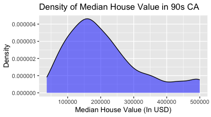

From this plot of the distribution of median house value, it can be
concluded that the data is heavily left skewed meaning that there is a
larger percentile of homes within the \$0 to \$250,000 price range. This
trend is similarly shown in other data samples generated from varying
seeds. One aspect to notice of this graph is the small inflection
towards the right end of the distribution function where the amount of
homes at the given price range tends to increase in comparison to the
amount at the intermediate value. In conjunction, these two observations
of the data suggest to us that the median housing values across the
state of California tend to be representative of higher volumes in the
\$100,000 range while the amount of homes decreases as the price
increases except for an outlying greater number of homes in the higher
price range. In addition to the distribution function, it can be
beneficial to display more information about the break down of this
variable’s distribution. Concisely, using the ‘skim’ function from the
‘skimr’ package in R will give us a brief summary of the statistics that
we can utilize later on in our analysis.

``` r
skim(data_sample$median_house_value)
```

| Statistic              | Value   |
|------------------------|---------|
| Mean                   | 210,605 |
| Standard Deviation     | 113,318 |
| 1st Percentile (1st)   | 36,700  |
| 25th Percentile (25th) | 127,025 |
| Median (50th)          | 185,100 |
| 75th Percentile (75th) | 263,925 |
| Maximum (100th)        | 500,001 |

### The Relationship Between Ocean Distance and Property Value

Now that we have introduced and begun to discuss one of the more
influential variables form the California Housing data set, its
imperative that we take a deeper look into more variables, as well as
analyzing any relationships they might have with one another. One of the
more obvious relationships that can be observed from the data without
much foresight is a possible connection between the median property
value of homes within a block and the distance that the corresponding
block is from the ocean. Based on intuition and general knowledge, it’s
safe to assume that it is very likely that houses that are closer to the
beach are more likely to have a higher median property value, and vice
versa. Consequently, we can use formulas built into R to take a look at
a the possible existence of a relationship between the variable “Median
House Value” and “Ocean Proximity” to see if we our intuitions are
justified. The following graph plots Median House Value within each
block in the sample data set against the block’s proximity to the ocean.

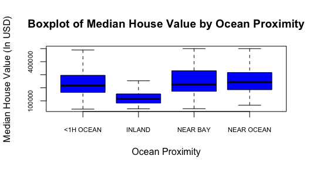

As the box plot above demonstrates, there seems to be a trend that homes
within the data sample tend to have an increased property value if they
are under an hour away from the ocean or a bay in comparison to homes
inland in California. These observations concur with the data samples
generated by different seeds.

### Median Income Analysis

Another very influential variable from the data set is the observations
of “Median Income” throughout houses on an identified block. This
variable gives the median income, in tens of thousands of United States
Dollars, of each block. Therefore, each individual within a home
contributes to their houses income, which then outlined per block where
the median is then calculated which is the resulting value that is
contained in the data set. This variable can be quite insightful to the
audience as well because it is closely relatable to the viewer;
therefore, understanding the statistical data around it is quite
important. Like shown before with the median house value variable,
utilizing R plot the distribution function for this variable is a good
place to start.

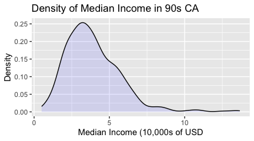

Similarly to the distribution graphs shown earlier, a quick and brief
analysis of the distribution of Median Income shows that the
distribution is also heavily skewed to the left. As a result, it
suffices to say that both median income and median housing value contain
some factors that draw out their distributions in such a manner.
Likewise, utilizing ‘skimr’ produces a concise table of the mean,
standard deviation, and percentiles in order to perform greater
statistical analysis.

``` r
skim(data_sample$median_income)
```

| Statistic              | Value (In 10,000s of USD) |
|------------------------|---------------------------|
| Mean                   | 3.9                       |
| Standard Deviation     | 1.82                      |
| 1st Percentile (1st)   | 0.5                       |
| 25th Percentile (25th) | 2.62                      |
| Median (50th)          | 3.6                       |
| 75th Percentile (75th) | 4.87                      |
| Maximum (100th)        | 13.66                     |

### The Relationship Between Property Value and Income

Lastly, it is of note to pay close attention to the relationship between
both of these two variables listed above. Even though they share quite
similarly left skewed distributions does not mean that they pertain any
relationship. In order to dive a little bit deeper into these two
statistics, we can graph a scatter plot in R that demonstrates their
potential correlation which can be further refined later down the road.

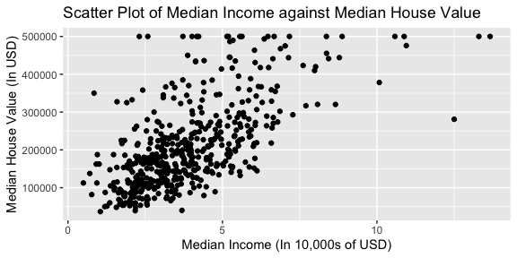

When layed out in a scatter plot as done above, these two variables
demonstrate a linear progression of increasing value. Seemingly, as the
median income of a particular housing block increases, so does the
median house value.

<br>
<br>

## Project Step 2
### Descriptor

The California House Pricing Dataset from Kaggle encapsulates a snapshot
of houses within specific Californian blocks as recorded during the 1990
census. The dataset encompasses a range of attributes that define these
housing units, and we focus on two key variables: total rooms and total
bedrooms for each housing block. These variables of interest offer
valuable insights into the dynamics of the housing market in California.
As we explore this dataset, we aim to understand if there is an
association between the total number of rooms and the total number of
bedrooms within the average California block, and whether their
association is linear.

To begin the analysis of the data, we must take take a look at the
formula for simple linear regression:

$$
Y = \beta_0 + \beta_1x + \epsilon
$$

In this model, $Y$ represents the
response variable which is the total number of bedrooms. $x$ represents
the explanatory variable which is the total number of rooms. $\beta_0$
represents the intercept of the regression line in the model, or what
the value of the response variable would be if the explanatory variable
was set to zero. $\beta_1$ represents the slope of the regression line
which demonstrates how the dependent variable changes with each unit
change of the explanatory variable. $\epsilon$ is the error term which
represents the difference between the actual values and the predicted
values of the response variable. With this knowledge as a foundation, we
can formulate our null and rejection hypothesises for our data:

$$
H_0: \beta_1 = 0 \quad (\text{Total rooms and total bedrooms do not have a linear correlation})
$$
$$
H_1: \beta_1 \ne 0 \quad (\text{Total rooms and total bedrooms have a positive/negative linear correlation})
$$

Now, we must begin to test our data to see if it follows the four
assumptions for simple linear regression: linearity, constant
variability, independence and normality of errors, and homoscedasticity.
First, we can plot our two variables against each other and visually
observe if there is a seemingly linear trend between the data.

<div class="figure" style="text-align: center">

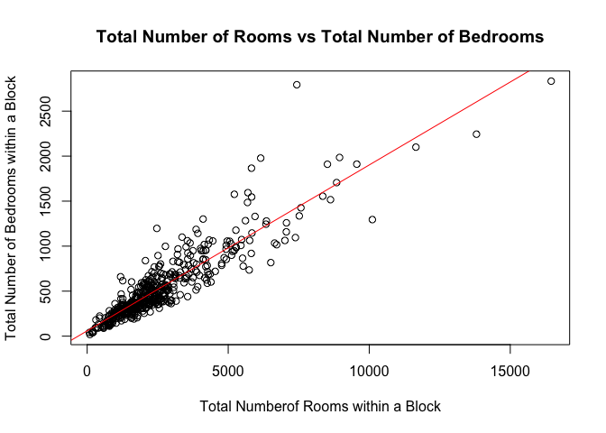
<p class="caption">
Figure 1: Plots the total number of rooms against the total number of bedrooms in
a given block in California
</p>

</div>

As shown above in Figure 1, the association between the total number of
rooms and the total number of bedrooms seemingly having positive slope
linear relationship. We can assume this because of the linear regression
line following has a positive slope that coincides quite closely with
the data. Next, we can utilize checks to see if the following
assumptions also apply to our data.

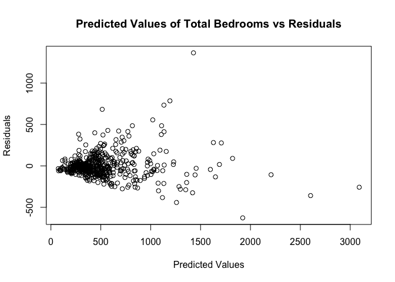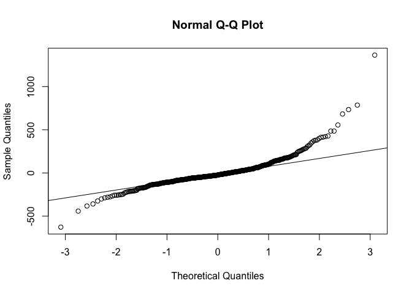
<p class="caption">
Figure 2: Predicted Values of Total Bedrooms vs Residuals<br>
Figure 3: Q-Q Plot of Normal Errors
</p>

Figures 2 plots the predicted values of the response variable against
the residuals. From this, we can notice how a density band travels in a
straight line across the plot. In the lower domain of the x-axis, the
data is densely clustered together, suggesting that the variance of the
data in this range is constant. Additionally, this can inform us that
there is likelihood that the total number of rooms indeed has a linear
correlation with total number of bedrooms. Because the data is more
centralized when the predicted values are 1000 or less, it could mean
that total number of rooms is a greater determinant of the total number
of bedrooms when the total number of rooms is less than 1000, and
perhaps other variables become more influential in determining the total
of the response variable as the total number of rooms increases.
Meanwhile, the Q-Q plot of the data in Figure 3 demonstrates a linear
trend of the residuals. This means that, under the assumptions of the
linear regression model, we can indeed assume that the errors are
normally distributed.

    ## 
    ## Call:
    ## lm(formula = total_bedrooms ~ total_rooms, data = data_sample)
    ## 
    ## Residuals:
    ##     Min      1Q  Median      3Q     Max 
    ## -627.31  -76.48  -23.26   46.76 1364.36 
    ## 
    ## Coefficients:
    ##             Estimate Std. Error t value             Pr(>|t|)    
    ## (Intercept) 59.09981   12.10192   4.884           0.00000141 ***
    ## total_rooms  0.18428    0.00383  48.110 < 0.0000000000000002 ***
    ## ---
    ## Signif. codes:  0 '***' 0.001 '**' 0.01 '*' 0.05 '.' 0.1 ' ' 1
    ## 
    ## Residual standard error: 157.7 on 496 degrees of freedom
    ##   (2 observations deleted due to missingness)
    ## Multiple R-squared:  0.8235, Adjusted R-squared:  0.8232 
    ## F-statistic:  2315 on 1 and 496 DF,  p-value: < 0.00000000000000022

The above data outlines the summary of the linear regression model for
the variables of total rooms against total bedrooms. From the given
stats, we can deduce that the response variable, $Y$, increases by
0.18428 units for ever unit increase of the explanatory variable, $x$,
given the error is less than 5%. Additionally, the $R^2$ value is equal
to 0.8235. This is pivotal as it means that the explanatory variable can
explain 82.35% of the change in the response variable. Additionally, the
shown p-value of the linear regression model is less than
$2.2 \times 10^{-16}$. Together, the elements of the linear regression
model demonstrate that we can assume that the explanatory variable, the
total number of rooms, has a significant affect on the response
variable, the total number of bedrooms. Therefore, we reject the null
hypothesis that $\beta_1 = 0$.

    ##                2.5 %     97.5 %
    ## (Intercept) 35.32247 82.8771586
    ## total_rooms  0.17675  0.1918013

In addition to this, the above command gives the confidence interval for
the coefficient of the explanatory variable, $\beta_1$, which is
(0.17675, 0.19180).

Next, we analyze our data based on an interesting value of the
independent variable. Looking at Figure 1, we can see a dense
distribution of observations where the value of total rooms is equal to
2500, so lets select that as our interesting value to look into.

    ## [1] "Confidence Interval for an Individual Response:"

    ##        fit      lwr     upr
    ## 1 519.7889 505.8937 533.684

As show above, the confidence interval for an individual response
variable with the explanatory variable being 2500 ranges between 505.89
total bedrooms and 533.684 total bedrooms at a 95% confidence interval.
This means that if we are to select a block with exactly 2500 total
rooms, we will have a 95% confidence that there are between 505 and 534
bedrooms. This can be visually validated by looking at the density of
observations in Figure 1 and where the values of x = 2500 correspond to
on the Y axis.

Lastly, it is important to discuss how we interpret $R^2$ in our data.
Because of the summary of our linear regression model from earlier, we
know that the $R^2$ equals:

    ## [1] 0.8235217

As $R^2$ ranges from 0-1, the higher the number, the greater the
correlation in the data. Because our value is 0.82351, it is highly
likely that our explanatory variable is linearly influential on our
response variable. Also, as figure 2 outlines, the residuals seem to
represent a constant variance at lower levels of the predicted values,
and gradually gain variance as the values increase. In essence, this
means that other factors begin to influence the relationship of total
bedrooms and total rooms as the number of rooms overall increases,
suggesting that the relationship may not be entirely linear.

### Conclusion

From our brief analysis, we have come to the assumption that there is
seemingly a positive linear correlation between the total number of
rooms and the total number of bedrooms within an average California
housing block when considering an error smaller than 5%. From the data,
we concluded that when the explanatory variable, total rooms, increases
by 1 unit, the response variable, total bedrooms, increases by 0.18428.
In the same manner, we found that the explanatory variable can explain
82.35% of the inflection upon the response variable. In sum, these
factors mean that $x$ is significantly influential on $Y$, and we can
reject the null hypothesis of $\beta_1 = 0$. We also found that the 95%
confidence interval for coefficient of $x$ to be between 0.17675 and
0.19180, validating our rejection of the null hypothesis. In conclusion,
we have deemed that the total number of rooms is a sufficient predictor
for determining how many total bedrooms houses within a block will have,
as they maintain many attributes of a linear correlation.

<br>
<br>

## Project Step 3
### Descriptor

The California House Pricing Dataset from Kaggle encapsulates a snapshot
of houses within specific Californian blocks as recorded during the 1990
census. The dataset encompasses a range of attributes that define these
housing units. In this step of our analysis, we will be attempting to
construct a multivariate linear model that can help us analyze trends
and correlations between variables within the dataset. Last time we
looked at the association between the total number of rooms within a
housing block and the total number of bedrooms to see if that
association was linear. In our conclusion from the last step of the
project, we determined that it was highly likely that a linear
association did exist between these variables, and we are now aiming to
expand upon these finding to discover a newer multiple linear regression
model that further our understanding of the data provided by the 1990
California Housing census.

### Choice of Response Variable

After discovering the existence of a linear trend between the variables
for total rooms and total bedrooms, we decided to seek a further
understanding of how these and other variables influence the total
population for a given block. Therefore, we explicitly chose Population
as the response variable that we seek to formulate a linear model
around. Dissection of the trends behind this variable is important
because it can potentially demonstrate societal trends, be a guidance
for taxation/funding/residential distribution, and many more factors
that are influenced by the census data.

<div class="figure" style="text-align: center">

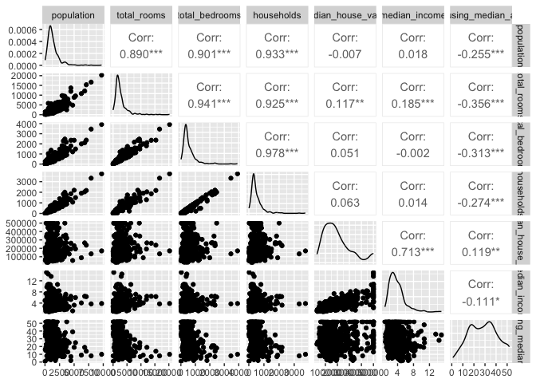
<p class="caption">
Output of the ggpair() Function from the California 1990 Census Data
</p>

</div>

### Determing the Variables of a Model

First things first, we can take a look at the output from the ggpair()
function provided by the GGally library. Selecting certain variables
that we are interested in (population, total_rooms, total_bedrooms,
households, median_house_value, median_income, and housing_median_age)
allows us to see a collection of plots depicting the various
associations within each variable pair. From the ggpair() output above,
we can see that a seemingly positively linear correlation exists between
the response variable and 3 potential explanatory variables:
total_rooms, total_bedrooms, and households. This enlightens us that we
are on the right path in determining if these factors have any influence
on our response variable, population. Meanwhile, the rest of the output
shows us that data plotted between population and our other potential
explanatory variables have a much more indescribable distribution.
Additionally, the correlation coefficient given between the population
as the response variable and the additional variables of
median_house_value, median_income, and housing_median_age are low enough
to disregard any relation that they may have. Therefore, we will try to
exclude those three variables for the majority of our analysis and focus
solely on total_rooms, total_bedrooms, and households as potential
significant explanatory variables. For simplicity’s sake, we derive the
name “Countable Variables” to total_rooms, total_bedrooms, and
households based on the fact that they are finite and countable in order
to avoid confusion.

### Validating our Variables and Deciding On a Model

To further our findings from the above section, we can create a few
regression models to help validate our choice of explanatory variables
as well as our intentional exclusion of variables that do not have an
association with our response. First, we create a basic linear model,
which we can nickname the “Full Variable Model” because it contains all
the variables that we were initially give. This regression model will
follow the formula given below:

$$
Y = \text{Population} = \beta_0 + \beta_1(\text{total rooms}) + \beta_2(\text{total bedrooms}) + \beta_3(\text{households}) + \beta_4(\text{median house value}) + \beta_5(\text{median income}) + \beta_6(\text{housing median age}) + \epsilon
$$

So, our goal is to determine if this model is an accurate representation
of the relationship between the variables inputted to the model and the
response variable that comes out. Upon a brief first look, we can see
that the Full Variable Model contains 2 explanatory variables that have
very high p-values, meaning that they do not play a significant role in
affecting the outcome of our model. These variables, median_income and
housing_median_age, are two of the variables which we hypothesized
earlier to not fit into our model due to the lack of an apparent
relationship. The p-values in the model summary further conclude this to
be the case, and we can be rest assured that their exclusion will not
have a dramatic impact on the accuracy of the linear regression model.
While all other variables in the model have low p-values, it is
important to note that the variable for median_house_value did not
suggest any linear relationship between population and house value. In
fact, the plots outlined by the ggpairs() plots suggest no relationship
at all. Because of this failing the assumption of linearity, and we can
exclude it from our data as well. Therefore, we a justified in negating
these variables from our linear model and still assuming we have high
accuracy. And thus, we are left with the resulting linear model, which
we can nickname the “Countable Variables Model” because it’s composition
of easily countable whole values:

$$
Y = \text{Population} = \beta_0 + \beta_1(\text{total rooms}) + \beta_2(\text{total bedrooms}) + \beta_3(\text{households}) + \epsilon
$$

Because the ggpair() function shows an apparent visual positive linear
correlation from these countable variables, this model may be quite a
succinct descriptor for our response variable. Comparing the R squared
output of these two models,

    ## R Squared For Countable Variables Model: 0.8859306

    ## R Squared For Full Variable Model: 0.8942953

tells us that around 88.6% of the variance from the Countable Variable
Model can be described by the explanatory variables, while 89.4% can be
explained by the explanatory variables in the Full Variable Model. This
distinctly is quite interesting, because the model we deemed to be
inaccurate has a higher R squared than the model which we ended up with.
It is for this reason that we need to analyze consider all of the data’s
influences when assessing trends, because the correct model ended up
with a lower score. Despite this however, an R squared value of 0.8859
in this case leads us to believe the accuracy of the linear model.
Additionally, we can check the fitted values versus the residuals to
determine if the model has constant variance, outlined by the two
following plots.

<div class="figure" style="text-align: center">

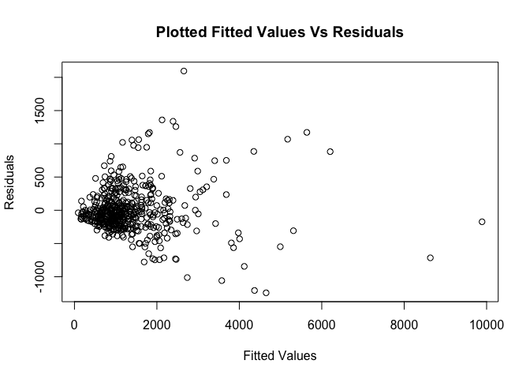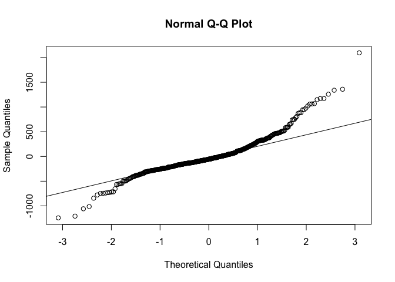
<p class="caption">
Test for Constant Variance within the Countable Variables Model
</p>

</div>

As shown above, the variance seems constant for smaller values, but a
fan shape appears to form as the values of the response mean increase.
This leads us to believe that there is greater variance of the response
for higher values of the explanatory variables in the data set. After
attempting numerous transformations, we seem to conclude that the base
model without transformations will provide us with the greatest
accuracy. Sacrificing some variance towards the upper percentile of
values means that the model can more accurately depict values towards
the lower end. For that reason, we have decided to leave the Countable
Variable Model without any additional transformations.

While we have come up with a model that fits our response variable, that
does not mean that additional models exist which may provide a greater
analysis of the data. For example, we can write a linear model, which we
can nickname the “Interaction Model”, with the input being the
interaction between two variables, total_bedrooms and number of
households based on their interactions as follows:

$$
\text{Population} = \beta_0 + \beta_1(\text{total bedrooms}) + \beta_2(\text{households}) + \beta_3\left(\frac{\text{households}}{\text{bedrooms}}\right) + \epsilon
$$

This formula produces a regression model with a similar response
variable output, except it depends on the interaction between
total_bedrooms over the total number of households. This is an
acceptable analysis to make due to the fact that there is seemingly some
relationship between these two explanatory variables. The low p-values
of the regression model conclude that these variables are indeed
significant, and an R squared value of 0.8727 hints that the variables
are indeed influential. This is intuitive because the greater the number
of bedrooms within a block, the more the households which results in a
greater overall population. However, it is important to keep in mind
that perhaps there can be a greater number of bedrooms within a
household, arbitrarily inflating the the population count.

While both the Interaction Model and the Countable Variables Model offer
decent regression models that provi de their own benefits for
determining the response variable, ultimately the extremely lower
p-values and higher R squared and R squared adjusted values for the
Countable Variables Model leads us to pick that as the accepted model
for our regression analysis.

### Brief Regression Model Summary

In order to help summarize our model for our data, we can formulate our
null and alternative hypothesis as:
$$H_0: \beta_i = 0 \text{ and } H_a: \beta_i \ne 0 \text{ for } i = 0, 1, 2, 3$$
Meaning that the null hypothesis is not rejected if a coefficient is
deemed to be not significant, and the null hypothesis is rejected if a
coefficient is deemed to be significant.

    ##                                           (Intercept) 
    ## 0.000001248279494694101276675208579691744859019308933 
    ##                                           total_rooms 
    ## 0.000000000010062134002385085980991942924428229075642 
    ##                                        total_bedrooms 
    ## 0.000000000306239535935825477448390288088241051323024 
    ##                                            households 
    ## 0.000000000000000000000000000000000000000000000468738

Because each of the above p-values is less than $\alpha$ at 0.05, each
variable is significant and the null hypothesis is rejected. In our
case, the coefficients values for each $\beta_i$ are 126.64, 0.15,
-1.28, and 3.13 for $i = 0, 1, 2, 3$ respectively. And as stated before,
the corresponding R squared and adjusted R squared values for the
Countable Variable Models are as follows:

    ## R Squared For Countable Variables Model: 0.8859306

    ## Adjusted R Squared For Countable Variables Model: 0.8852351

Both of these values are high, which is good news for our model! But
that does not guarantee their accuracy. Like we stated before, we
sacrificed accuracy in the higher values of our models for more accuracy
overall. While our constant variance snag that we encountered earlier
was not a major factor, it will increase the band of the confidence
intervals of our model overall.

### Influence Points Analysis

<div class="figure" style="text-align: center">

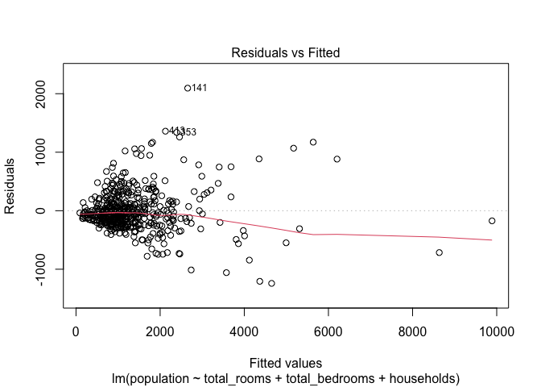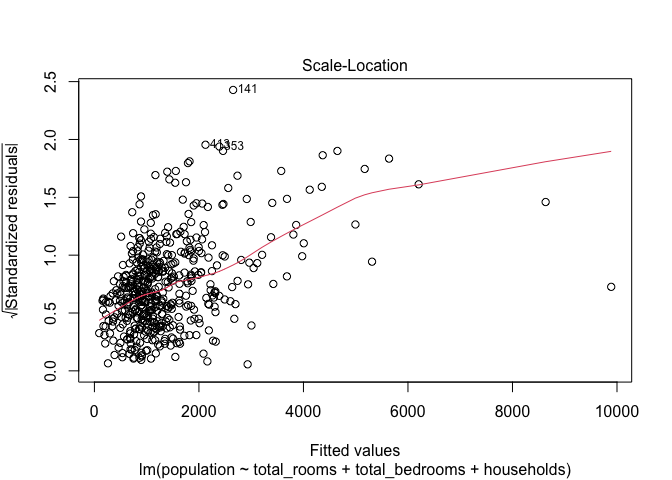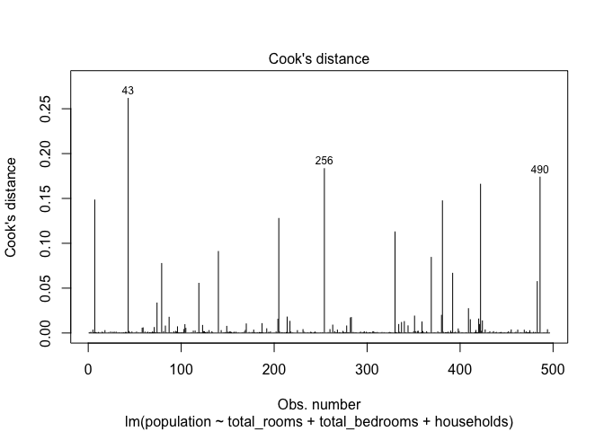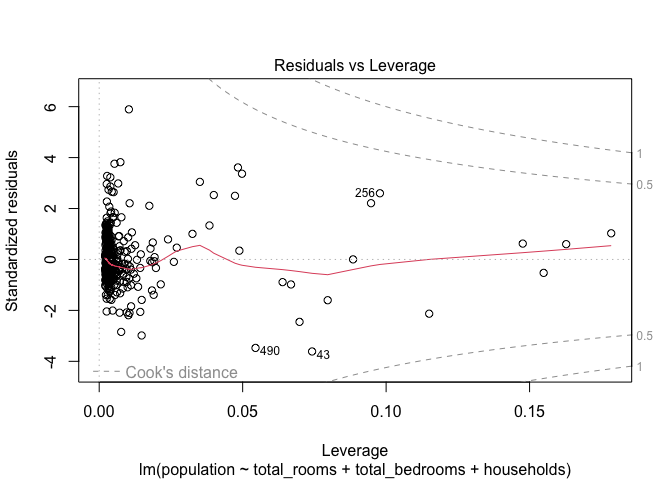
<p class="caption">
Inluence Analysis
</p>

</div>

The above plots can help us highlight trends within the data that may
lead to an influence away from a particular expected response. Data
points that fall out of the common variance trend within a data set can
have a drastic impact on the accuracy of the model, so taking these
steps to conclude where influence and leverage inflection points are is
a pivotal step in further understanding our multiple regression model.
As shown above in the Cook’s Distance plot, there a number of
observation within our sample that have a much greater distance away
from the expected interval, notably the 43rd, 256th, and 490th
observations. Noting the location of these influence points can help
deduce where the variance is coming from in the data. Additionally, if
we look at the Residuals versus Leverage graph, we can see that there is
a large cluster of data points centralized around the lower distances
from the interval. This cluster ends at approximately 0.035, meaning
that values that go beyond this limit are the beginning of what can be
considered a leverage point all the way up till the end at almost 0.20.
Overall, adjusting for these leverage and influences points can usually
help deduce a more accurate model. In our case however, it seems that
the non-constant variance associated with the lack of model
transformation is partially at fault for these inaccuracies. Therefore,
we feel it is not impotent to completely remove these outliers from the
data set in order to receive a more accurate measurement than already
predicted through our acceptance of nonconstant variance for our model.

### Confidence Intervals for Predicted Values

    ## Predicted Mean and it's Confidence Interval

    ##        fit      lwr      upr
    ## 1 723.2806 678.7648 767.7965

    ## Future Predicted Value and it's Prediction Interval

    ##        fit      lwr     upr
    ## 1 723.2806 19.98152 1426.58

As shown above, we can calculate a given predicted mean and future
predicted value along side their respective confidence interval when
given initial conditions. If we take our predictor variables for
total_rooms to equal 1500, total bedrooms to equal 200, and households
to equal 200, we get the information state above about the expected
response variable. As shown, the 95% confidence interval for the
predicted mean is between 678.8 and 767.8 given those conditions with
the expected mean being 723.3. Likewise, if we calculate the future
predicted value given those constraints, the lower bound is
approximately 20.0 with an upper bound of 1426.6 at a confidence
interval of 95%, which is suspiciously large. Similarly to the predicted
mean, the future predicted value is the same at 723.3. Ultimately, we
can see that our model is not the most accurate when it comes to the
prediction interval of the response variable, which is mostly based out
of the high input numbers which is greatly effected by the non constant
variance as shown above.

### Conclusion

The multi-variable linear regression model that we formulated from the
California 1990 Housing Census takes into account basic housing and
household variables in an attempt to find the response variable
estimating the total population within a housing block. While the
association between the data is linear, the existence of nonconstant
variance in higher values within the data set leads to some inaccurate
predictions using the formulated model. Overall, however, the model
seems to produce roughly accurate results that may provide a greater
insight into predicting the total population within a block based merely
off the construction of the buildings that reside in that block. The
regression model presents a positive, linear correlation between the
explanatory variables and the response variables, insinuating that as
the amount of households, bedrooms, and rooms increase, the overall
population is quite likily to increase as well.

<br>
<br>

## Project Step 4
### Descriptor

The California House Pricing Dataset from Kaggle encapsulates a snapshot
of houses within specific Californian blocks as recorded during the 1990
census. The dataset encompasses a range of attributes that define these
housing units. In this step of our analysis, we will be attempting to
further dissect our multiple linear model that we previously built by
applying shrinkage methods to our model. In multiple linear regression,
the purpose of the techniques of specific shrinkage methods is to
counteract the inaccuracies of multicollinearity and model overfitting.
In order to accomplish this, we will randomly sample 500 observations
from the data and fit them to our model and execute ridge regression and
LASSO regression techniques to better fit our multiple linear model.

### Shrinkage Methods

The first step of our dissection of our previously drawn up model is to
compare it to a model without any modifications. Therefore, the
following output is the summary of a linear regression model with all
numerical variables as the predictors.

                             Estimate    Std. Error    t value     Pr(>|t|)
    (Intercept)        195.9052315453 63.7866882689  3.0712557 2.250321e-03
    housing_median_age   2.6781007808  1.4075281272  1.9026979 5.766708e-02
    total_rooms          0.1819696346  0.0265555296  6.8524197 2.192930e-11
    total_bedrooms      -1.3736850886  0.2119119543 -6.4823388 2.210059e-10
    households           3.1104121962  0.1931884094 16.1004079 4.178242e-47
    median_income        6.2507239555 14.4528051578  0.4324921 6.655745e-01
    median_house_value  -0.0009630353  0.0002094803 -4.5972598 5.457146e-06

    R^2 of the basic model: 0.8950722

Now that we know these values, we can utilize them to compare and
contrast the model we developed in the last part, as well as perhaps
create a new model that aims to provide even greater accuracy than
before. To do this, we can take our basic model and check the eigen
decomposition of $x^Tx$, which returns the following:

    Eigen decomposition:  1 91.8146 1171.665 3885.293 13522.47 182795.6

From this, we can calculate the R$^2$ value for each of our predictor
variables. This will tell us efficinecy of using our each of these
predictors in our model.

    R-squared for each predictor: 

    housing_median_age: 0.2401913               total_rooms: 0.9292011

    total_bedrooms: 0.9715387                    households: 0.9579462

    median_income: 0.6979749                    median_house_value: 0.6019585

As shown above, three of our variables have a very high coefficients of
determination, two have coefficients of determination that are roughly
average, while one has a coefficient that is relatively low. Because the
first three, total_bedrooms, total_rooms, and households, all have such
a high value, they are succinct to be in our model. Now on the other
hand, the inclusion of the three variables with lower coefficients of
determination means that either they are likely poor(er) predictors of
the response variable, population. Now, we can take a look at the
variance inflation factors to see how they contribute to each predictors
variance within the linear model.

    housing_median_age        total_rooms     total_bedrooms         households 
              1.316121          14.124514          35.135446          23.779075 
         median_income median_house_value 
              3.310983           2.512301 

From these results, the question arises as to why a model that includes
worse predictors of the response variable has a higher coefficient of
determination value than one that does not. As in page two of step 3, we
recall that the R$^2 = 0.88593$ for the model we settled on, while this
one was R$^2= 0.8950722$. Well, this can be caused by noise of variance
that the model doesn’t account for, or simply put the model is more
accurate with these variables included. To dissolve the answer to this
question, we can look to two methods of shrinkage to highlight the best
model we can for our data.

### Ridge Regression

Under the technique of ridge regression, the assumption is that the
regression coefficients shouldn’t be too large after normalization. The
first step we must take is create multiple models with different lambda
values, then find the one that minimizes the inaccuracies of the
response. Essentially, we are formulating new models with a range of
lambda values in order to generate a new linear model with the best fit
for the data. Once we have this, we will plug in our best lambda value
into the ridge regression model in order to get an accurate model.

The range of these lambda values are given in the figure on the
following page, Figure 1 which plots Lambda values versus $\hat{\beta}$.

From that graph and further calculation, we can come to the conclusion
that the lambda value of,

    Best Lambda Value: 98.34711

is what we will use for our ridge regression model.

<div class="figure" style="text-align: center">

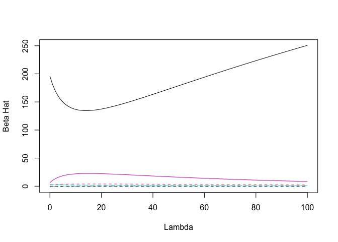
<p class="caption">
Figure Demonstrating the Lambda versus Beta Hat
</p>

</div>

Additionally, we can take the produced ridge regression model and find
the generalized crossvalidation value. As shown below, the output values
of 0.0 and 1 from the analysis indicate that the first element minimizes
the Generalized Cross-Validation criterion. Because of this, selecting
our lambda value to be 0.0 would be a worthwhile choice for our Ridge
Regression model as the low GCV criterion demonstrates that the model’s
complexity and fit are justifiably balanced. From this output, we can
safely assume that our ridge regression model provides an adequate
prediction for our data as a whole.

    Generalized crossvalidation value: 

      0.000000 
             1 

To be succinct, listed below is the scaled coefficients of the intercept
as well as each variable with the model given by the ridge regression
model, along side the R-squared of the model.

    7 x 1 sparse Matrix of class "dgCMatrix"
                                   s0
    (Intercept)        187.1116995281
    housing_median_age   2.8088604026
    total_rooms          0.1754168111
    total_bedrooms      -1.2489728832
    households           3.0077776964
    median_income        8.8783856063
    median_house_value  -0.0009831492

Leaving us with the regression model following the form:
$$\text{Population} = 187.11 + 2.808x_1 + 0.175x_2 - 1.250x_3 + 3.008x_4+8.88x_5 - 0.0009x_6$$
where $x_1$ is housing_median_age, $x_2$ is total_rooms, $x_3$ is
total_bedrooms, $x_4$ is households, $x_5$ is median_income, $x_6$ is
median_house_value.

### Lasso Regression

While Ridge Regression created a new model to adjust for the overfitting
of our data, we can also use another technique known as Lasso regression
to create another model we can compare against. Like with Ridge
Regression, the first step in creating this model is to isolate the best
lambda for the fit of our data. To do this, we can input our data into
the cv.glmnet function, followed by using that model and finding the
minimuim lambda value for our data.

    Best Lambda for our Models: 0.5248489

As shown above, the lambda value for this model is 0.5248, which is what
we will use when we predict the observations given a set of predictions.
Given below is graph of log($\lambda$) versus the Mean Squared Error of
our data. This plot essentially tells us the most appropriate level of
regularization for a predictive model. The best lambda value given
above, can be found plotted in the figure below suggesting to us where
the balance of the model is most even.

<div class="figure" style="text-align: center">

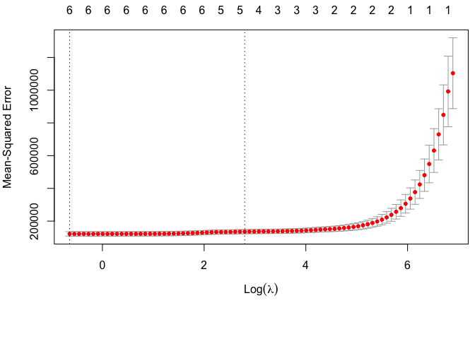
<p class="caption">
Figure Demonstrating the Log of each Lambda versus MSE
</p>

</div>

Likewise with this model, we are given the intercept and coefficients of
our model, as shown below.

    Best Model Coefficients:

    7 x 1 sparse Matrix of class "dgCMatrix"
                                   s0
    (Intercept)        192.1178566312
    housing_median_age   2.6686465652
    total_rooms          0.1751836571
    total_bedrooms      -1.2823129776
    households           3.0451067258
    median_income        7.6271246950
    median_house_value  -0.0009637222

A brief analysis of these coefficients tells us that median_house_value
and total_rooms are the variables that have the least influence per unit
change on the response due to their low values, while
housing_median_age, households, and median_income have the most
influence per unit change. This is quite an interesting statistic
because housing_median_age and median_income were variables with lower
correlation than many of the other predictors. This can indicate that
while they do not have the biggest correlation with the explanatory
variable, population, when their influence is apparent, it is
considerably large.

As with Ridge Regression, we can deduce the formula for the Lasso
Regression model as the following:

$$
\text{Population} = 192.11 + 2.668x_1 + 0.175x_2 - 1.282x_3 + 3.045x_4+ 7.67x_5 - 0.0009x_6
$$

where $x_1$ is housing_median_age, $x_2$ is total_rooms, $x_3$ is
total_bedrooms, $x_4$ is households, $x_5$ is median_income, $x_6$ is
median_house_value.

### Model Comparison

Lastly, we can take a look and see how these models compare against one
another. In order to do this, we can plot them together.

<div class="figure" style="text-align: center">

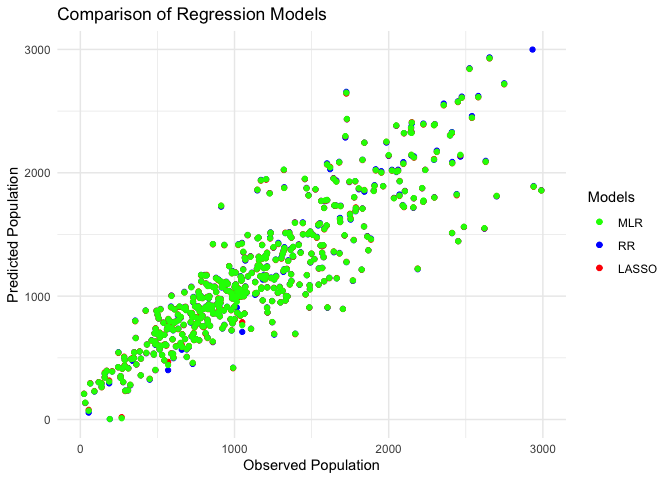
<p class="caption">
Comparison of Models: MLR, RR, and LASSO
</p>

</div>

It is important to note that the scatter plot above excludes multiple
observations with values above 3000 on both the x-axis and y-axis. This
is done to illustrate the scatter of data points better in the lower
regime of values. With that in mind, we can delineate from the scatter
plot above that each model seems to be very close in predicting values
relatively to one another. No model in particular seems to have a
greater skew than another, as nearly all the data points are very
similar to each other. This is interesting as it can give us insight
into the accuracies of our models and how sufficient they are at
predicting our response variable.

### Conclusion

The three models that we formulated in this data step all seemed to
accurately represent the data with consistency. It is of interesting
note just how similar the models were to one another. While coefficients
of each linear model is different, their differentiation is quite
minimal. Ultimately, the shrinkage models add onto the analysis through
the multiple linear regression model by combatting any unobserved
inaccuracies of multicollinearity and model overfitting. In conjuncture
with each other, these models validate that we have assembled strong
evidence that our formulate basic multiple linear regression model is a
sufficient predictor for the variable of population with the California
1990 census data set. Ultimately, we believe that we can confidently use
any of these linear models in order to make estimates about our data and
accurately make predictions for future estimations.

### Innovation

We chose to use the Box-Cox Method for Transformations because we
noticed that the variables in Step 1 and 2 were very skewed and with
many outliers. For example, as shown below, a histogram displaying the
median income for one to buy a house shows most of the data at the left
of the x-axis. By making using this method, we can make the non-normal
data into a normal distribution.

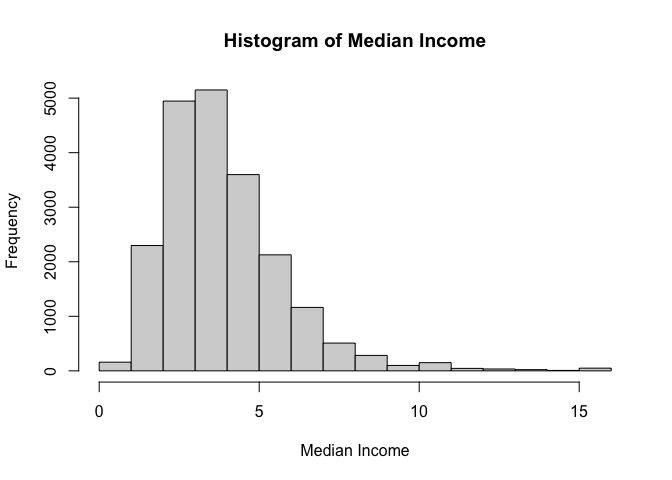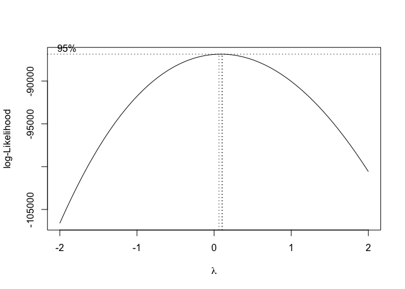

Here we show the box cox transformation of the variable. We can see that
there is a small 95% confidence interval that is a little bit greater
than 0, with the middle dashed vertical line representing the estimated
parameter lambda hat. As shown below, with the lambda equaling to 0.10,
we can create a new regression model with the variable, using the
equation:

$$
Y_t = \frac{1}{\lambda}(X^\lambda_t - 1)
$$

    Lambda Parameter:  0.1010101

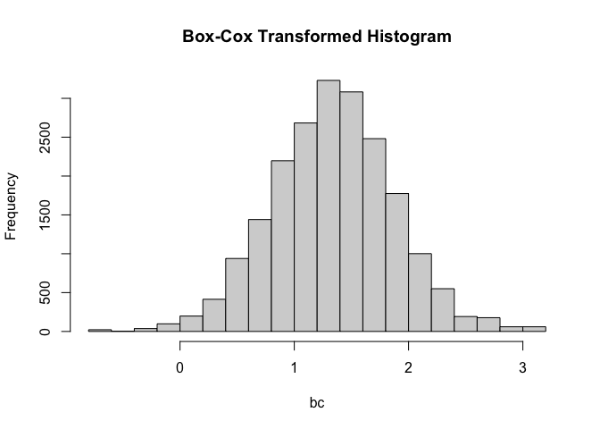

    Variance Before Transformation:  3.609323

    Variance After Transformation:  0.283955

This new histogram displays the median income for California houses at a
normal distribution. In addition, not only did the transformation
stabilized the variance, but it also helps us find patters in the data.
This aids us with finding trends and patterns with the variables,
allowing us to make more accurate results and better decisions when
interpreting the data.
